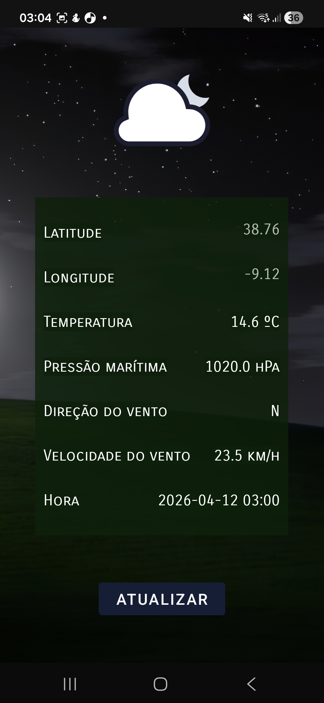
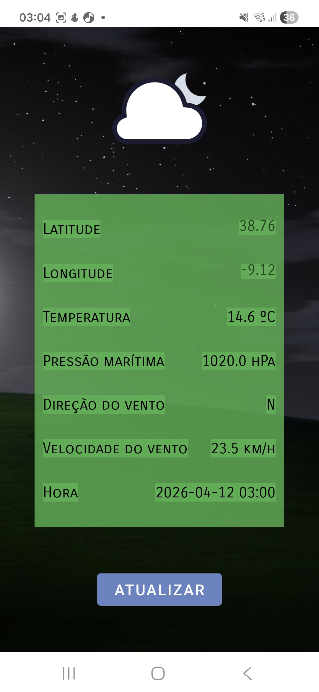
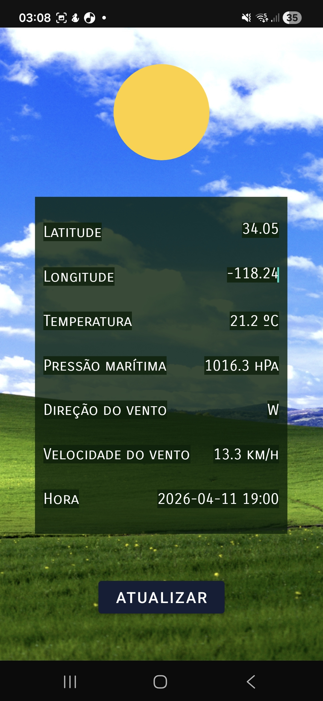
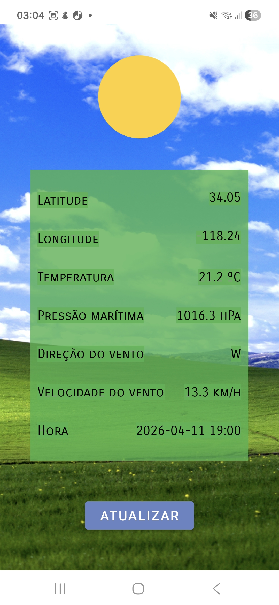

# Assignment 2 - Weather App

Course: Desenvolvimento de Aplicações Móveis  
Student(s): Zilda Biai (51606)  
Date: 12/04/2026  
Repository URL: [Cool Weather App](https://github.com/z1lyb/Desenvolvimento-de-Aplicacoes-Moveis-SV2526/tree/main/TP2/CoolWeatherApp)

---

# Tutorial 2 - Kotlin Exercises

## 1. Introduction

O presente repositório foi criado no âmbito da disciplina de Desenvolvimento de Aplicações Móveis, durante a realização 
do segundo tutorial da disciplina. Este relatório consistirá na descrição do trabalho referente à _**Section 2: Android - The Cool Weather App**_.  
O propósito desta secção é de desenvolver uma aplicação que apresente informações relativas à meteorologia de um determinado local, 
aplicando o uso e acesso a APIs externos.

## 2. System Overview
A aplicação final desenvolvida consiste numa interface Android que mostra o estado de tempo numa 
determinada localização, customizável pelo utilizador a partir da sua latitude e longitude, predeterminadas para as de Lisboa.
A informação apresentada sobre a localização é:
* Temperatura
* Pressão marítima
* Direção do vento
* Velocidade do vento
* Hora  

A imagem de fundo da aplicação é de dia ou noite com base na hora de nascer e pôr do sol da localização 
correspondente, assim como a aplicação conta com um modo claro e escuro, dependendo da selecionada no dispositivo. 

## 3. Architecture and Design
O projeto segue a estrutura de aplicações Android, onde as classes Kotlin foram criadas como 
subpastas da dam.A51606.coolweatherapp.
Os recursos adicionais utilizados, como ícones, layouts e temas situam-se na pasta **res**.
A classe principal do programa é a **MainActivity**, usada para o inicializar.

## 4. Implementation
### Layout da aplicação
O layout da aplicação é composto por quatro temas, claro e escuro, com uma versão para o dia e noite 
do local para cada um. Os temas foram definidos no ficheiro **themes.xml**, assim como a disposição 
dos componentes foi criada no **activity_main.xml**, com variantes para modo _portrait_, _landscape_
e tablet. 

### Acesso ao API e tratamento de dados
Para o acesso à informação do API providenciado pelo enunciado, foram criadas as _data classes_ **WeatherData**, **CurrentWeather** 
e **Hourly**, para guardar informação relativa a cada localização. Adicionalmente, foi criada a enum WMO_WeatherCode, que guarda as associações entre ícones apresentados e estados de tempo.

Na classe principal, MainActivity, foram implementadas funções de acesso à informação do API e atualização do UI em função 
da sua informação, interagindo com as classes anteriormente mencionadas.

### Resultado final
As imagens que se seguem ilustram o resultado final da aplicação.
Durante a noite local (Meteorologia _default_ de Lisboa, à noite):

Durante o dia local (Meteorologia de Los Angeles, de dia):

## 5. Testing and Validation
A aplicação foi testada em emuladores de Google Pixel 3, Google Tablet e num dispositivo real Samsung, 
onde se verificou o funcionamento dos modos Portrait e Landscape, assim como o funcionamento do acesso à 
API e possíveis casos de erro.

## 6. Usage Instructions
1. Abrir o projeto no Android Studio.
2. Ligar um emulador ou conectar um dispositivo Android.
3. Correr a aplicação.

---

# Autonomous Software Engineering Sections - only for [AC OK, AI OK] sections
Não foi utilizada inteligência artificial no desenvolvimento da aplicação. 
Toda a programação foi desenvolvida autonomamente, com consulta à documentação oficial de Kotlin, 
assim como os websites GeeksforGeeks e StackOverflow. O relatório presente também foi inteiramente escrito por mim.

---

# Development Process

## 12. Version Control and Commit History
O trabalho foi mantido em repositório Git local, assim como remoto no GitHub. 
Os commits realizados foram incrementais, refletindo a evolução do projeto e não apenas a sua finalização.

## 13. Difficulties and Lessons Learned
A principal dificuldade ultrapassada na realização da aplicação foi a implementação dos diferentes
_layouts_ de informação e utilização dos seus _constraints_, tendo acabado por ter sucesso na sua implementação.

## 14. Future Improvements
Possíveis funcionalidades a implementar como melhoria:
* Guardar informação de temperatura em cache, a ser apresentada quando o utilizador se encontre offline.
* Possibilidade de o utilizador escolher uma cidade em vez das suas coordenadas, associando-as automaticamente.
* Implementação do modelo MVVM, para obtenção de um código mais limpo.

---

## 15. AI Usage Disclosure (Mandatory)
Não foi utilizada inteligência artificial na implementação deste repositório. Sou, portanto, 
responsável por todo o conteúdo incluído nos ficheiros.
